# ◈ Memento

**一个会记住经验的编码 Agent，一份永远诚实的规格。**

[English](README.md) | [中文](README.zh-CN.md)

Memento 是面向终端的规格驱动（SDD）编码 Agent。每次会话结束时，它会做一次反思（reflection），把发生的事提炼成**经验（lessons）**——带置信度存储：被证据证实则上升，被现实反驳则下降。每次任务开始时，它先召回相关规格与经验，于是这个 Agent 在**你的**代码库上越用越聪明。

<p align="center">
  <a href="https://github.com/memento-agent/memento/actions/workflows/ci.yml"></a>
  <a href="https://www.npmjs.com/package/memento-agent"></a>
  
  
  
  
</p>

<p align="center">
  
</p>

```console
$ memento run "给登录接口加上限流"

◈ memento v0.2.0 · deepseek/deepseek-chat · ~/work/api
task: 给登录接口加上限流
▸ recalled 2 lesson(s) from memory
▸ indexing repository
▸ building

◈ agent started · model deepseek-chat
⏺ read(src/auth/login.ts)  read(src/middleware/index.ts)
── turn 2 ──
⏺ write(src/middleware/rate-limit.ts)  edit(src/auth/login.ts)
⏺ bash(npm test)
  120 passed
◈ agent finished: done

▸ reflecting on the session（自我进化环节）
  +1 新经验 · [pattern] 登录路由统一经过 middleware/index.ts
suggested commit feat: rate-limit the login endpoint
  (memento never commits for you — paste this into git commit -m)

◈ session s_h8x2kd91mf · done · 3 turn(s) · 8.2k in / 1.1k out
resume: memento resume s_h8x2kd91mf · replay: memento show s_h8x2kd91mf
```

---

## 为什么还要再做一个 Agent？

市面上的终端 Agent 大多才华横溢，但患有失忆症：

- **它会忘**。每个会话从零开始。昨天你解释过的约定、上周它踩过的坑——全部归零。
- **规格会烂**。文档与代码渐行渐远，直到无人信任。**无法校验的规格只是许愿。**
- **扩展是负担**。插件要构建、要清单、要版本矩阵——于是没人写插件。
- **生态是外挂**。MCP 支持往往意味着又一个配置文件、又一个进程、又一个信任问题。

Memento 用四个答案回应这四个问题。

### 一、有脊梁的记忆：置信度加权经验

反思不是聊天记录。每次会话后，Agent 提炼出**经验**——约束、模式、失败、偏好、发现——写入 `.memento/memory/lessons.jsonl`：纯文本、可审计。

每条经验都带置信度，有真实的动力学：

| 事件 | 效果 | 依据 |
| --- | --- | --- |
| 新经验 | 置信度 `0.35` | 未经证实 |
| 被强化（再次出现且被证实） | `+0.15` | 重复即证据 |
| 被反驳（现实不一致） | `−0.30` | **证伪权重大于证实** |
| 置信度 `< 0.12` | 退休 | 保留在日志中，移出召回池 |

新经验一次矛盾即退休（`0.35 − 0.30 = 0.05`）；被证实过一次的经验（`0.50`）能挺过一次矛盾，第二次才退休。这是刻意的：**错误的记忆比没有记忆更糟**。所有经验都不删除——退休只是移出召回池，日志可查。

召回按相关性排序（与任务的词项重叠 + 新鲜度 + 置信度），只有排名靠前的经验注入系统提示词。Agent 不会淹死在自己的历史里。

### 二、会"回话"的规格

`memento spec init` 扫描仓库并起草：

```
.memento/spec/
├── constitution.md      # 不可协商的项目宪法
├── architecture.md      # 系统如何组成
├── features/*.md        # 每个特性的行为契约
└── decisions/NNNN-*.md  # 架构决策记录（ADR）
```

纯 Markdown，可被 git diff，没有数据库。

关键在于 `memento spec verify`：**确定性检查器**（完全不调用 LLM）把规格的声明与真实目录树做对照——

- 反引号里提到的仓库路径必须真实存在；
- 提到的 `npm run x` 必须在 `package.json` 里有对应脚本；
- 未解决的 `TODO`/`TBD` 占位符会被暴露出来。

任务开始前，**spec gate** 召回相关规格段落并提问：这个任务是否与宪法或已接受的决策冲突？你只需要回答一次，答案会被记录。会话结束后再校验一遍。**进门时请教规格，出门时核对规格**——这才是规格活着的方式。

### 三、十行写完、卸载干净的插件

把 `.ts` 文件丢进 `.memento/plugins/`——不用构建、不用清单、不用发布。启动时通过 [jiti](https://github.com/unjs/jiti) 直接加载。

```ts
// .memento/plugins/changelog.ts
import type { MementoPlugin } from "memento-agent";

export default {
  name: "changelog",
  register(api) {
    api.tools.register({
      name: "changelog_add",
      description: "向 CHANGELOG.md 追加一行",
      parameters: { line: { type: "string", description: "条目文本", required: true } },
      async execute({ line }, ctx) { /* ... */ },
    });
    const off = api.events.on("session_end", (e) => console.log("bye", e.sessionId));
    return () => off(); // disposer —— 注册可逆
  },
} satisfies MementoPlugin;
```

每次 `register` 都返回 **disposer**。卸载插件时，它做过的所有注册——工具、事件监听、规格检查器——全部回滚。**插件是客人，不是住户。**

### 四、生态原生：MCP、git、undo、commit 建议

Memento 说生态的语言，而且双向都会：

- **MCP 服务器**——`memento serve-mcp` 把你的 Agent 记忆暴露给**其他**工具。Claude Desktop、Cursor、goose……任何 MCP 客户端都可以通过 stdio 搜索经验、添加经验、读取记忆统计。你 Agent 来之不易的知识不再锁死在终端里。
- **MCP 客户端**——在 `~/.memento/config.json` 里声明外部 MCP 服务器，它们的工具会以 `mcp_<server>_<tool>` 的形式桥接进会话。项目级声明只有在显式设置 `trustProjectMcp: true` 后才加载——`git clone` 下来的仓库**不可能**静默在你的机器上拉起进程。
- **git 内建**——Agent 通过只读的 `git_status` / `git_diff` / `git_log` 工具了解仓库状态，而不是瞎猜。循环结束后，memento 读取工作区 diff（含已跟踪**和**未跟踪文件），给出 conventional commit 格式的提交建议。它**从不**执行 `git commit`——历史始终归你。
- **Undo**——每次 `write` / `edit` / `apply_patch` 都会把改前状态快照到 `.memento/undo/`。`memento undo` 逐批回滚上一次写入。给文件系统装上安全气囊。
- **先计划后动手**——`memento plan` 在动任何文件之前先起草 Plan/Act 计划。批准后 Agent 逐步执行；拒绝则一切如初。
- **断点续跑**——`memento resume s_…` 继续被中断的任务：完整转录重新喂给模型，循环在**同一个**会话日志里继续，审计轨迹始终是一条完整故事（verify → reflect → commit hint 全部重跑）。
- **基准测试**——`memento bench tasks.json` 把一族相似任务跑两遍对比：冷跑（全新副本、零记忆）vs 热跑（召回经验），输出学习曲线——随着经验积累，轮数与 token 究竟省了多少。`--dry` 换成确定性零网络 provider，CI 与演示里都能实测记忆效应。
- **Agent 链路**——内建 `subagent` 工具派出一名只读探索者回答一个问题：它在自己的迷你循环里 read/grep 仓库，返回浓缩答案，长文件转储不再撑爆你的上下文。子会话拥有自己的 JSONL 转录并由主日志链指；探索者不能嵌套派发（无递归、无写入）。

---

## 快速开始

```bash
# 需要 Node ≥ 20.10
npm install -g memento-agent

# 新项目？从模板开始：
memento new my-app && cd my-app

# 在已有仓库里：
cd your-project
memento init                 # 脚手架 .memento/
export DEEPSEEK_API_KEY=…    # 也可以用 OPENAI_API_KEY / ANTHROPIC_API_KEY
memento spec init            # 扫描仓库，起草宪法 + 架构
memento doctor               # 体检：运行时/配置/规格/记忆/插件
memento run "解释 auth 如何工作，然后加一个 /healthz 路由"
```

想直接改源码？

```bash
git clone <this repo> && cd memento
npm install
npm run check      # typecheck + 148 个测试
npm run build      # dist/cli.js，约 160 KB
node dist/cli.js run "…"
```

第一次用 memento？`memento new my-app` 直接脚手架 [examples/starter-template/](examples/starter-template/)——自带 spec、bench 任务族和 15 分钟全流程导览。

---

## 一次任务的完整闭环

```
召回 ──► 规格门禁 ──► 构建 ──► 校验 ──► 反思 ──► commit 建议
  │         │           │         │         │           │
  │         │           │         │         │           └─ 基于 diff 的 conventional 提交信息（绝不代提交）
  │         │           │         │         └─ 提炼经验，更新置信度
  │         │           │         └─ 确定性检查器再次运行
  │         │           └─ Agent 循环：工具执行，每步写入 JSONL
  │         └─ 与宪法的冲突在动手之前就浮出水面
  └─ 相关规格段落 + 排名最高的经验进入系统提示词
```

每次会话都以 JSONL 记录在 `.memento/sessions/` 下——每轮一行，完全可回放：

```bash
memento sessions              # 列出会话
memento show s_h8x2kd91mf     # 查看转录（任意唯一前缀即可）
```

转录就是审计轨迹：Agent 读了什么、写了什么、跑了什么，以及**它为什么相信它现在相信的东西**。

---

## 安全模型

编码 Agent 会在你的机器上执行命令。Memento 的默认值偏保守：

- **只读命令直接跑。** `ls`、`cat`、`grep`、`git status`、`npm test`——由 fail-safe 分类器识别，无需打扰。
- **其余一律需要审批。** 写入、重定向（`>`）、`sed -i`、装包、`git commit`——任何无法证明只读的都被拦截。分类器是 fail-safe 的：**识别不出 = 拦截，而不是放行。**
- **非交互会话默认拒绝。** 没有 TTY 就没有意外的擅自修改。
- **受保护的路径。** `.git/`、`node_modules/` 与机密文件（`.env*`、`id_rsa`、`id_ed25519`）对文件工具不可触及。
- **灾难模式硬性阻断**，无论审批设置如何：`rm -rf /`、fork 炸弹、写盘、凭据外流的命令形态。
- **MCP 信任是显式的。** MCP 服务器只从你的用户级配置（`~/.memento/config.json`）加载，从不来自克隆的仓库——除非你显式设置 `trustProjectMcp: true`。桥接来的写类工具同样走审批、与其他写入串行执行。

```jsonc
// .memento/config.json —— 按工具粒度选择自动批准
{ "provider": "deepseek", "model": "deepseek-chat", "autoApprove": ["write", "edit"] }
```

---

## CLI 速查

| 命令 | 用途 |
| --- | --- |
| `memento run <task>` | 跑一个任务走完整闭环（`--spec-gate ask\|auto\|off`、`-y`、`--max-turns`、`--no-reflect`、`--no-commit-hint`） |
| `memento plan <task>` | 动手前先起草 Plan/Act 计划供审阅（`-y` 直接批准并执行） |
| `memento undo` | 回滚上一批写入（write/edit/apply_patch 都有快照） |
| `memento init` | 脚手架 `.memento/` |
| `memento new <dir>` | 从内置 starter 模板脚手架新项目——spec + bench 任务 + 导览（`--force`、`--no-git`、`--template <dir>`） |
| `memento doctor` | 诊断运行时/配置/供应商/规格/记忆/插件 |
| `memento spec init` | 扫描仓库起草规格（`--scan-only` 只跑确定性扫描） |
| `memento spec verify` | 确定性检查器对照目录树（`--json`） |
| `memento spec status` / `spec show [file]` | 规格现状与内容 |
| `memento spec decision <title>` | 记录一条 ADR 提纲 |
| `memento lessons` | 列出经验（`--all`、`--json`），`--reinforce <id>`、`--contradict <id>`、`--retire <id>` |
| `memento remember <text>` | 手动记录经验——进入同一套置信度机制 |
| `memento sessions` / `show <id>` / `resume <id>` | 会话历史、转录与断点续跑（任意唯一前缀均可） |
| `memento bench <tasks.json>` | 任务族冷/热对比跑——实测记忆效应（`--dry`、`--json`、`--no-cold`、`--keep`） |
| `memento serve-mcp` | 通过 stdio 把记忆暴露为 MCP 服务器（搜索/添加经验、统计）——给 Claude Desktop、Cursor、goose…… |
| `memento web` | 在浏览器里打开只读工作台——规格、记忆、会话（`--port` 指定端口，`--no-open` 不自动开浏览器） |

所有命令都支持 `-C <dir>` 指定工作区根目录。

---

## 供应商

内置预设：**deepseek**、**openai**、**anthropic**、**ollama**、**moonshot**、**glm**（智谱）、**qwen**（阿里）——通过 `--provider` 或配置选择，凭据来自标准环境变量（`DEEPSEEK_API_KEY`、`OPENAI_API_KEY`…）。任何 OpenAI 兼容端点都可显式声明：

```jsonc
// .memento/config.json
{
  "provider": "local",
  "model": "qwen2.5-coder",
  "providers": [
    { "id": "local", "type": "openai-compat",
      "baseUrl": "http://localhost:11434/v1",
      "apiKeyEnv": "OLLAMA_API_KEY",
      "models": [{ "id": "qwen2.5-coder", "contextWindow": 32000, "maxOutput": 4000, "supportsTools": true }] }
  ]
}
```

---

## 设计原则

- **零锁定。** 四个运行时依赖（`commander`、`jiti`、`picocolors`、`zod`）。一切都用普通文件：Markdown 规格、JSONL 会话、JSON 配置。每份产物在工具死后依然可用。
- **该确定性的地方绝不用模型。** 规格校验与命令分类永不调用 LLM。模型做判断，代码做检查。
- **默认 fail-safe。** 无法识别的命令被拦截；非交互的修改被拒绝；受保护路径保持受保护；MCP 服务器需要显式信任。
- **可审计的记忆。** 置信度不是玄学——是你能读懂的算术，每次变动都附上引发它的证据。
- **可逆的扩展。** 每次注册都返回 disposer。`memento doctor` 精确显示每个插件贡献了什么。

**非目标：** 聊天 UI、自主式多 Agent 蜂群、托管服务。Memento 是可组合的引擎 + CLI。`memento-agent` 包同时导出完整 API（内核、规格、记忆、插件），供嵌入使用。

Agent 链路刻意只设一层：内建 `subagent` 工具派出只读探索者，探索者不能再派探索者——树保持浅层，转录始终可审计。

---

## 项目结构

```
src/
├── kernel/     agent 循环、会话日志（JSONL）、事件总线
├── spec/       扫描器、生成器、存储、确定性校验器
├── memory/     经验存储（置信度动力学）、反思、召回
├── tools/      内置工具（read/write/edit/ls/grep/glob/bash/git）+ undo 快照 + 安全分类器
├── llm/        供应商注册表、OpenAI 兼容 + Anthropic 适配器、SSE 解析
├── plugins/    jiti 加载器、能力接缝、disposer 管理
├── mcp/        stdio 线格式层 + 记忆服务器（serve-mcp）+ 客户端桥接
├── git/        基于 diff 的提交信息建议
├── web/        零依赖工作台 UI + 本地 JSON API
└── cli/        commander 装配、UI、工作区组装
```

贡献：`npm run check` 必须全绿（typecheck + 测试）。测试直连真实代码路径——包括一个讲真实 SSE 线格式的假 OpenAI 服务器、一个真实子进程的 MCP 服务器，完整闭环（模型 → 工具执行 → 会话日志 → 反思）端到端可测且不依赖网络。

---

## 致谢

Memento 站在两个被我们研读、运行、学习的项目肩上：

- **[pi](https://github.com/earendil-works/pi)** —— 它证明了 Agent 内核可以小而清晰：双层循环、截断安全阀、JSONL 会话日志、直接从 TypeScript 加载插件。
- **[deepseek-harness](https://github.com/deepseek-ai/deepseek-harness)** —— 它示范了能力接缝的纪律：返回 disposer 的注册、插件隔离、扩展之下依然成立的单调守卫。

Memento 在其上多走了一步：**让规格可校验，让记忆靠挣取**。完整且诚实的对比见 [docs/COMPARISON.md](docs/COMPARISON.md)。

## 许可证

MIT —— 见 [LICENSE](LICENSE)。
